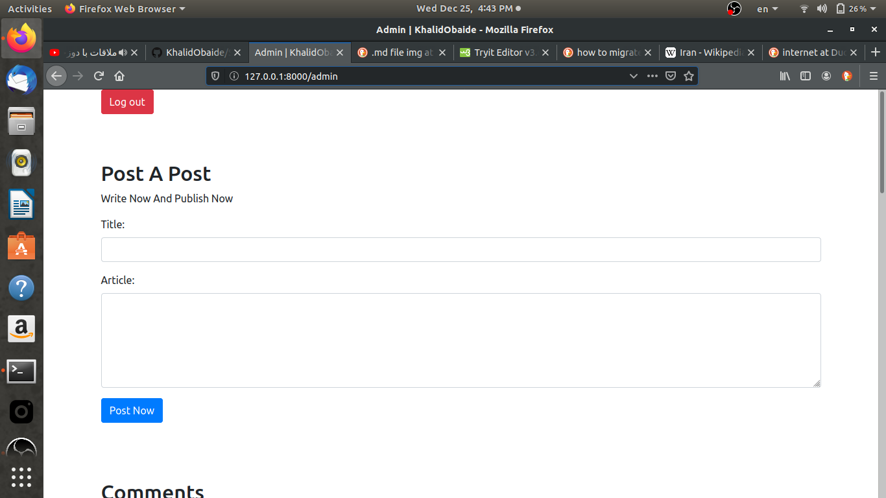
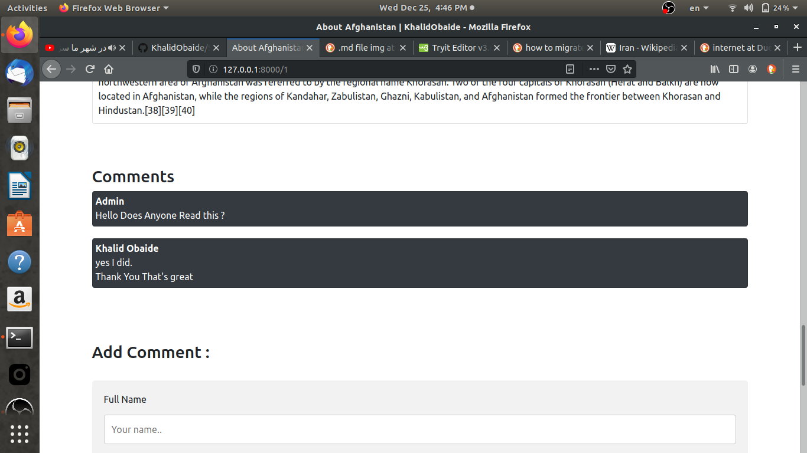

# Self Weblog 

This is A self weblog for free to use, Made By Khalid Obaide.
what is this ? 
	The Admin [Which is you] is the one who post articles in this weblog.
	The other people comes in and comments to your articles.
	They can also contact you, and you answer theme throug mail. In simple english there is a "contact me" page also
	There is only one admin 

# Setup 
	1. Download The Repository 
	2. install php.7.2.X, Laravel, and ...
	3. cd Self-Weblog-Laravel/weblog/
	4. php artisan serve
	5. And There Is your weblog open the browser on localhost:8000

# Tutorial 
	The Complete process of making this in laravel is avalible in :  https://www.youtube.com/channel/UCLRqcPs2OOPOEkew2Y-eoKw
	It is kind of streaming for long time no break challenge

# Khalid Obaide
	I Am Khalid Obaide The Creator Of This
	Follow me on social media: 
	youtube : https://www.youtube.com/channel/UCLRqcPs2OOPOEkew2Y-eoKw
	facebook : https://www.facebook.com/khalid.obaidi.56
	instagram : @Khalid Obaide
	everwhere : Khalid Obaide

